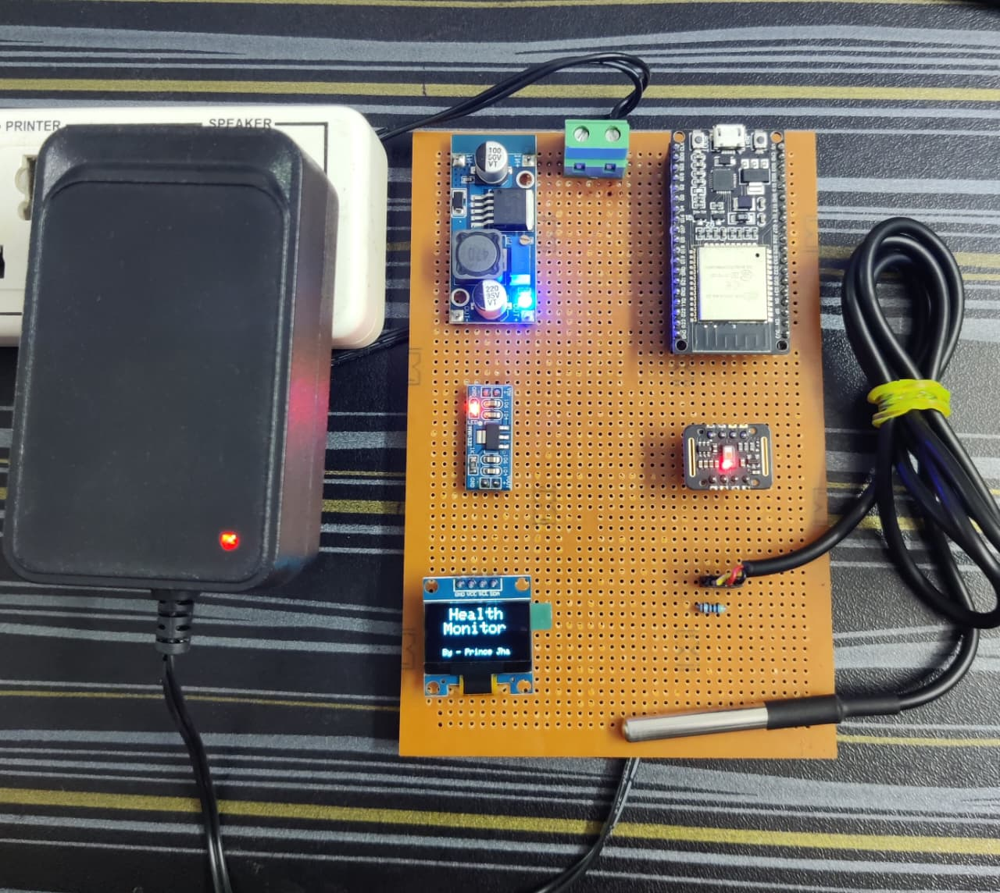
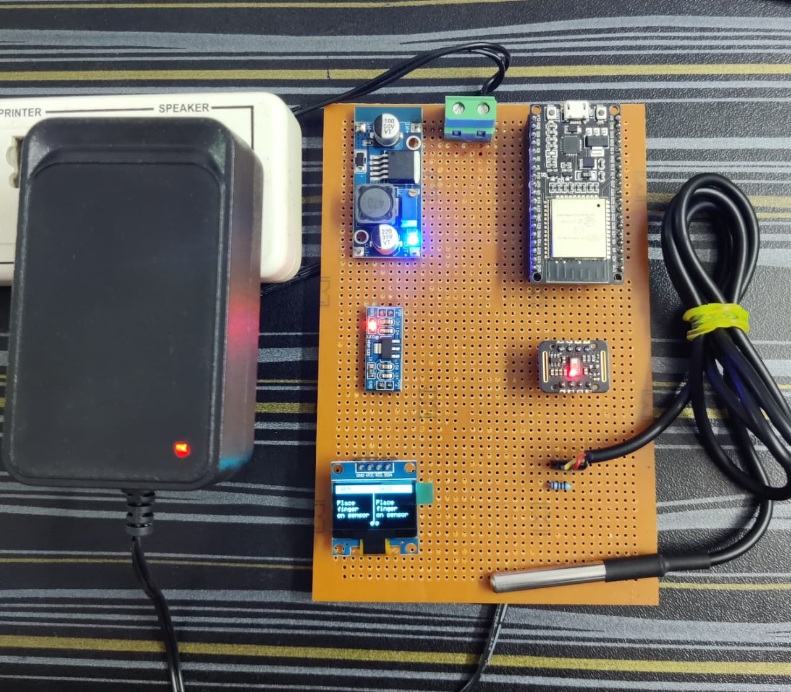
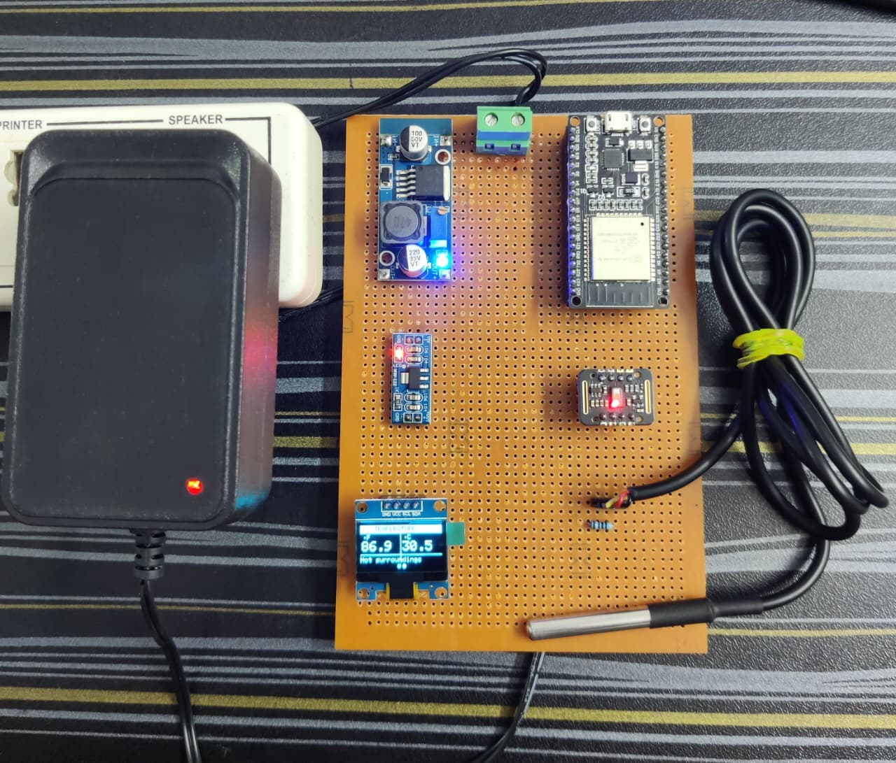
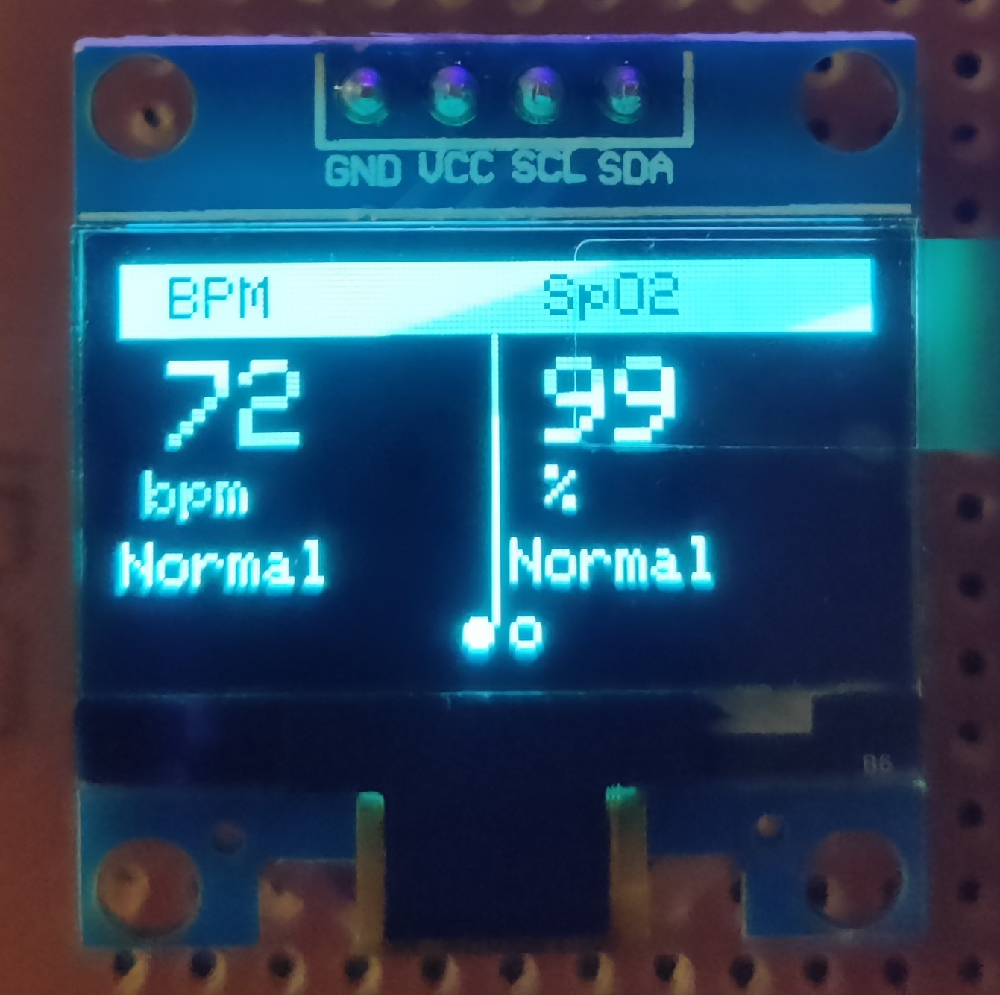
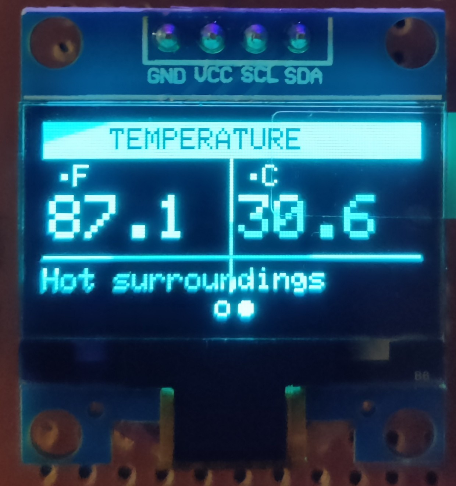
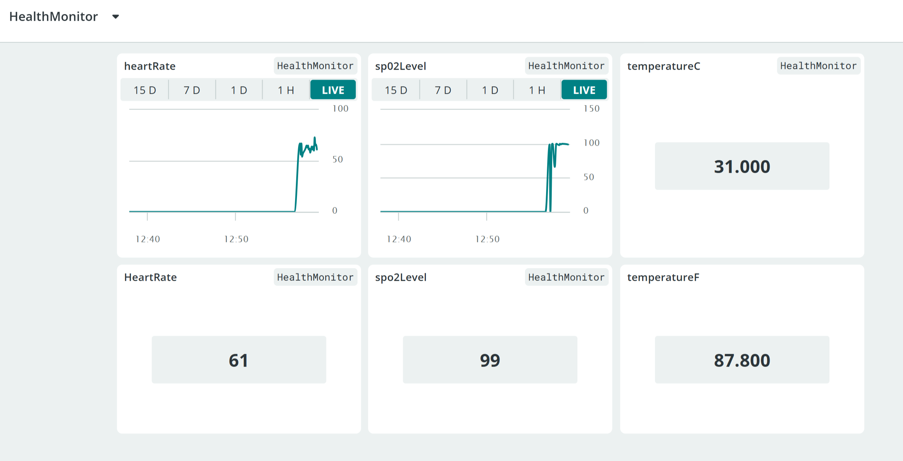
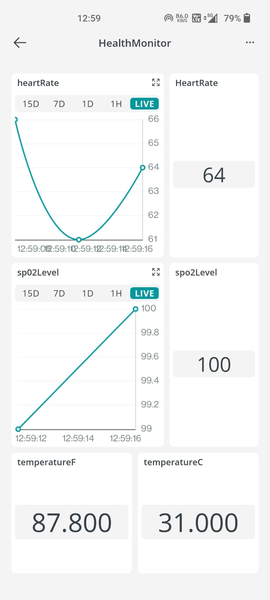

# [VitalSync - Health Monitoring System](https://iprince10.github.io/VitalSync_HealthMonitoringSystem/)

Real-time SPO2 · Heart Rate · Body Temperature · Cloud Sync

A wall-powered IoT health station built on ESP32 that continuously measures blood oxygen saturation, heart rate, and body temperature. Readings are displayed locally on an OLED screen and pushed live to Arduino IoT Cloud over WiFi via MQTT/TLS — accessible from anywhere through the Arduino mobile app.

---

## About

VitalSync is a standalone embedded health monitoring device designed for continuous, non-intrusive vital sign tracking. It uses a custom non-blocking firmware architecture — zero `delay()` calls — ensuring sensor readings, display updates, and cloud synchronization all run concurrently without stalling each other.

The device runs entirely on wall power through a regulated 12V → 5V → 3.3V supply chain, making it suitable for stationary home or clinical use. All sensor data is pushed to Arduino IoT Cloud every 5 seconds where it can be visualized on a live dashboard or through the mobile app.

Built as a B.Tech final project in Electronics & Communication Engineering at Jamia Hamdard, New Delhi.

---

## Components Required

| Component | Quantity | Purpose |
|---|---|---|
| ESP32 Dev Module | 1 | Main microcontroller — dual-core 240MHz, built-in WiFi 802.11 b/g/n, 3.3V logic |
| MAX30102 (Black PCB) | 1 | Pulse oximeter and heart rate sensor — integrated red (660nm) + IR (880nm) LEDs, 18-bit ADC, I2C address 0x57 |
| DS18B20 (Black Wire) | 1 | Digital body temperature sensor — 1-Wire protocol, ±0.5°C accuracy, range −55°C to +125°C |
| SSD1306 OLED 0.96" | 1 | Local display — 128×64 pixels, I2C address 0x3C, self-illuminating |
| LM2596 Buck Converter | 1 | 12V to 5V step-down, 75–90% efficiency, up to 3A output |
| AMS1117 3.3V LDO | 1 | 5V to 3.3V linear regulator for ESP32, OLED, MAX30102, DS18B20 |
| 4.7kΩ Resistor (1/4W) | 1 | Mandatory pull-up for DS18B20 1-Wire data line |
| 6x4 Perfboard | 1 | Point-to-point soldering base for permanent assembly |
| 12V DC Power Adapter | 1 | Wall power input to LM2596 buck converter |

---

## Pin Connections

| Component | Signal | ESP32 Pin | Note |
|---|---|---|---|
| MAX30102 | SDA | GPIO 21 | Shared I2C bus |
| MAX30102 | SCL | GPIO 22 | Shared I2C bus |
| MAX30102 | VIN | 3.3V | From AMS1117 |
| MAX30102 | GND | GND | Common ground |
| OLED SSD1306 | SDA | GPIO 21 | Shared I2C bus (addr 0x3C) |
| OLED SSD1306 | SCL | GPIO 22 | Shared I2C bus |
| OLED SSD1306 | VCC | 3.3V | From AMS1117 |
| OLED SSD1306 | GND | GND | Common ground |
| DS18B20 | DATA | GPIO 4 | 4.7kΩ pull-up to 3.3V required |
| DS18B20 | VCC | 3.3V | From AMS1117 |
| DS18B20 | GND | GND | Common ground |

All three sensors share the same 3.3V rail from the AMS1117. MAX30102 and OLED share the I2C bus on GPIO 21/22 at 400kHz Fast Mode. DS18B20 runs on a separate 1-Wire bus on GPIO 4.

---

## Features

**Real-Time Heart Rate Detection**
Custom peak-detection algorithm using an exponential moving average as a dynamic baseline. Designed to be accurate on low-amplitude PPG signals where standard libraries fail.

**Blood Oxygen (SpO2) Measurement**
Uses Maxim's official ratio-of-ratios SpO2 algorithm over a 100-sample rolling buffer with real-time signal quality validation.

**Dual-Unit Body Temperature**
DS18B20 reads every 3 seconds in non-blocking mode. Temperature is displayed simultaneously in both Fahrenheit and Celsius with clinical status text (Normal, Low, High).

**Auto-Rotating OLED Display**
Two pages rotate every 4 seconds automatically. Page 1 shows BPM and SpO2 with a live waveform. Page 2 shows temperature in both units.

**Arduino IoT Cloud Integration**
Four variables (heartRate, spo2Level, temperatureF, temperatureC) are pushed via MQTT/TLS every 5 seconds to Arduino IoT Cloud, viewable on a live dashboard or mobile app from anywhere.

**Non-Blocking Firmware Architecture**
Zero `delay()` calls in the entire codebase. All timing handled via `millis()` timers. The MAX30102 FIFO is serviced every loop iteration without stalling any other task.

**Regulated Wall-Power Supply**
12V DC input → LM2596 buck converter → 5V → AMS1117 LDO → 3.3V. Clean, efficient power delivery for all components without heat dissipation issues.

---

## Advancements

**Custom Peak Detection over Standard Libraries**
Most projects use the SparkFun MAX3010x library's built-in beat detection, which fails on weak or irregular PPG signals. VitalSync implements a hand-tuned exponential moving average baseline comparator that adapts to signal amplitude in real time, making it significantly more reliable across different skin tones and finger pressures.

**Throttled Cloud Polling**
Arduino IoT Cloud's `ArduinoCloud.update()` is called on a 100ms throttle rather than every loop iteration, preventing the blocking MQTT polling from interfering with the high-frequency sensor sampling loop.

**Non-Blocking DS18B20 Reads**
Standard DS18B20 implementations call `requestTemperatures()` and immediately block for ~750ms waiting for conversion. VitalSync separates the request and the read into two timed events 3 seconds apart, keeping the loop completely free during conversion.

**Dual I2C Device Management**
Both MAX30102 (0x57) and SSD1306 (0x3C) run on the same I2C bus at 400kHz Fast Mode without address conflicts, reducing wiring complexity and GPIO usage on the ESP32.

**Persistent Cloud Reconnection**
Uses Arduino's `ConnectionHandler` library which automatically manages WiFi drops, MQTT disconnections, and NTP re-sync (required for TLS authentication) — making the device resilient to network interruptions without manual resets.

**Expandable Cloud Variables**
The Arduino IoT Cloud Thing schema can be extended with additional variables (e.g., SpO2 alerts, BPM alarms) and connected to IFTTT or webhooks for automated notifications without changing any firmware.

---

## Working Images

<h2 align="center">Project Images</h2>

<table align="center">
  <tr>
    <td align="center">
      
    </td>
    <td align="center">
      
    </td>
    <td align="center">
      
    </td>
  </tr>
  </table>

 

<h3 align="center">OLED Images</h2>
<table align="center">
  <tr>
    <td align="center">
      
    </td>
    <td align="center">
      
    </td>
  </tr>
</table>

<h3 align="center">Web & Mobile Dashboards</h2>
<table align="center">
  <tr>
    <td align="center">
      
    </td>
    <td align="center">
      
    </td>
  </tr>
</table>

  

---
## Made By

**Prince Jha**  
B.Tech, Electronics & Communication Engineering  
Jamia Hamdard, New Delhi  

GitHub: [github.com/iprince10](https://github.com/iprince10)  
Project Site: [iprince10.github.io/VitalSync_HealthMonitoringSystem](https://iprince10.github.io/VitalSync_HealthMonitoringSystem/)
